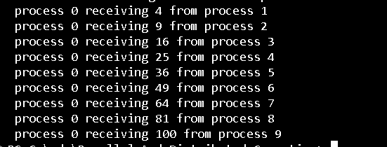

## **Chapter 4: Message Passing**

Message passing enables communication between processes in parallel programs. It allows processes to exchange data explicitly through send and receive operations, making it essential for distributed computing.

In this chapter, we cover the following recipes:
- Using the mpi4py Python module
- Implementing point-to-point communication
- Avoiding deadlock problems
- Collective communication using a broadcast
- Collective communication using the scatter function
- Collective communication using the gather function

### Requirements:
 The installation procedure of mpi4py on a Windows machine is as follows:

 pip install mpi4py
 
 This implies that the notation used to run the mpi4py examples is as follows:

 mpiexec -n x python mpi4py_script_name.py

 The mpiexec command is the typical way to start parallel jobs: x is the total number of
 processes to use, while mpi4py_script_name.py is the name of the script to be executed.

### **Why Use Message Passing?**
1. **Decoupling**: Processes operate independently and communicate only when necessary, enhancing modularity.
2. **Scalability**: It scales easily across different machines, making it suitable for distributed systems.
3. **Fault Tolerance**: Processes can handle failures gracefully, especially in distributed settings.

# 1. Point-to-Point Communication
Demonstrates inter-process communication using the `mpi4py` library:  
- Processes communicate using the `send` and `recv` methods.  
- Data is transmitted between specific processes identified by their ranks.  
This example showcases how processes can exchange data effectively in an MPI environment.

## Output

## Explanation
1. **Ranks Involved in Communication**:
   - **Rank 0** sends an integer to **Rank 4**.
   - **Rank 1** sends a string to **Rank 8**.

2. **Other Ranks**:
   - Ranks not involved print their own rank.

# 2. Deadlock Problem
Demonstrates a classic deadlock scenario using the `mpi4py` library:  
- Processes communicate using `send` and `recv` methods.  
- Deadlock can occur when two processes wait for each other to send and receive data, leading to a halt in execution.

## Output

## Explanation
1. **Ranks Involved in Communication**:
   - **Rank 1** sends `"a"` to **Rank 5** and waits to receive data from **Rank 5**.
   - **Rank 5** sends `"b"` to **Rank 1** and waits to receive data from **Rank 1**.

2. **Deadlock Issue**:
   - **Rank 1** sends data to **Rank 5** and waits to receive data from **Rank 5**.
   - **Rank 5** sends data to **Rank 1** and waits to receive data from **Rank 1**.
   - Both ranks wait for each other, causing a deadlock where neither can proceed. This happens because they both need to send and receive data simultaneously, but neither can do so because each is waiting on the other.

3. **Other Ranks**:
   - Ranks not involved in the communication simply print their rank and do not participate in the deadlock.

# 3. Broadcast Communication
Demonstrates the concept of broadcasting using the `mpi4py` library:  
- The root process (Rank 0) broadcasts a variable to all other processes.  
- All processes, regardless of rank, receive the same value from the root.

## Output

## Explanation
1. **Rank 0**:
   - **Rank 0** initializes the variable `variable_to_share` with the value `100`.
   - The value is broadcasted to all other processes using the `comm.bcast` method.

2. **Other Ranks**:
   - All other ranks (1, 2, 3, 4, 5, 6, 7, 8) receive the value `100` from **Rank 0** and print it.
   - The broadcast ensures that each process gets the same value, regardless of its rank.

# 4. Scatter Communication
Demonstrates the `scatter` operation using the `mpi4py` library:  
- The root process (rank 0) distributes different elements of an array to all other processes.  
- Each process receives a specific element from the array.

## Output

## Explanation
1. **Root Process (Rank 0)**:
   - **Rank 0** initializes an array `array_to_share` with the values `[1, 2, 3, 4, 5, 6, 7, 8, 9, 10]`.
   - The `comm.scatter` method is used to distribute the elements of this array to all processes in the communicator.

2. **Other Processes (Ranks 1 to 9)**:
   - Each process receives a specific element from the array, based on its rank. For example:
     - **Rank 0** receives `1`.
     - **Rank 1** receives `2`.
     - **Rank 2** receives `3`.
     - And so on until **Rank 9**, which receives `10`.
   - Each process prints its rank and the value it received.

# 4. Scatter Communication
Demonstrates the `scatter` operation using the `mpi4py` library:  
- The root process (rank 0) distributes different elements of an array to all other processes.  
- Each process receives a specific element from the array.

## Output

## Explanation
1. **Root Process (Rank 0)**:
   - **Rank 0** initializes an array `array_to_share` with the values `[1, 2, 3, 4, 5, 6, 7, 8, 9, 10]`.
   - The `comm.scatter` method is used to distribute the elements of this array to all processes in the communicator.

2. **Other Processes (Ranks 1 to 9)**:
   - Each process receives a specific element from the array, based on its rank. For example:
     - **Rank 0** receives `1`.
     - **Rank 1** receives `2`.
     - **Rank 2** receives `3`.
     - And so on until **Rank 9**, which receives `10`.
   - Each process prints its rank and the value it received.
