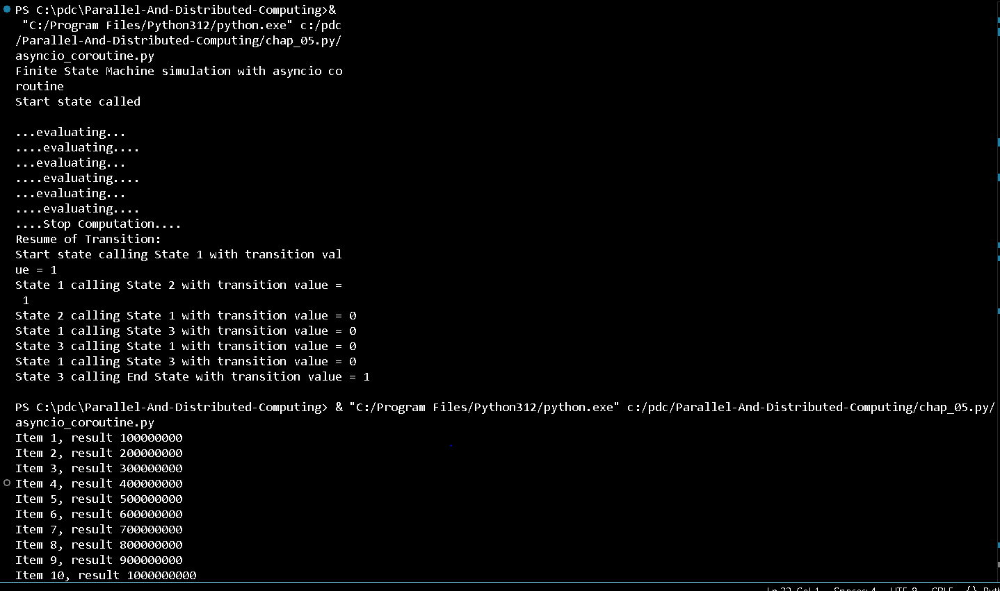
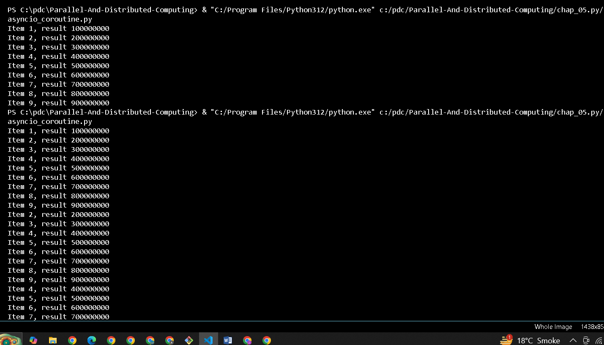
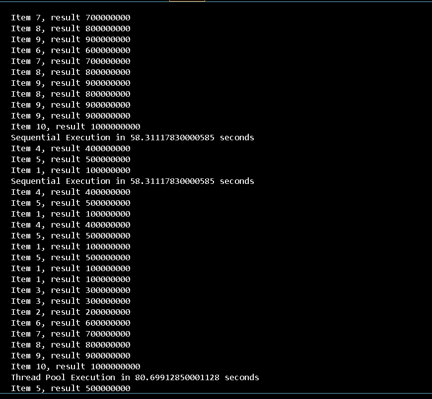
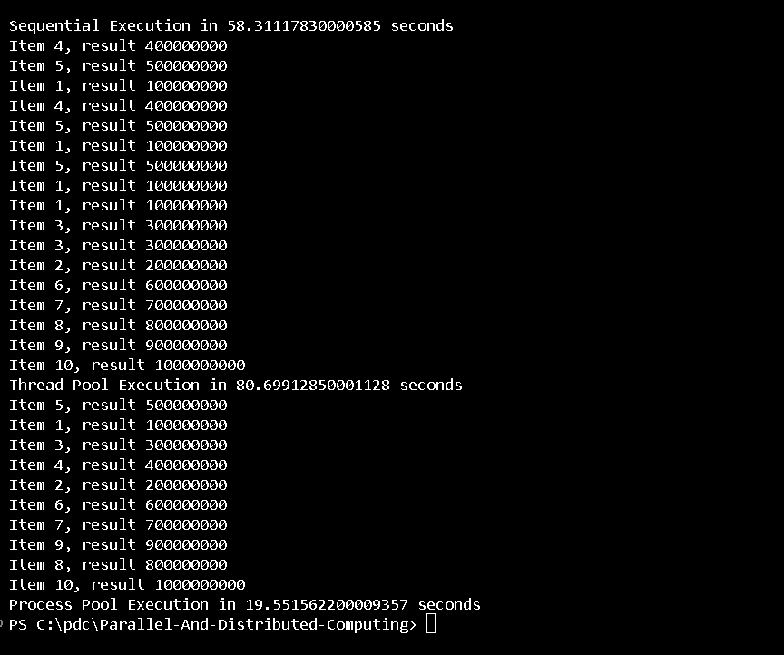
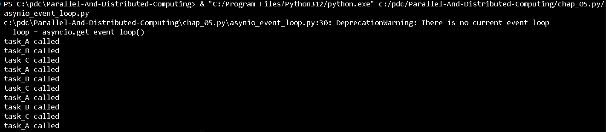
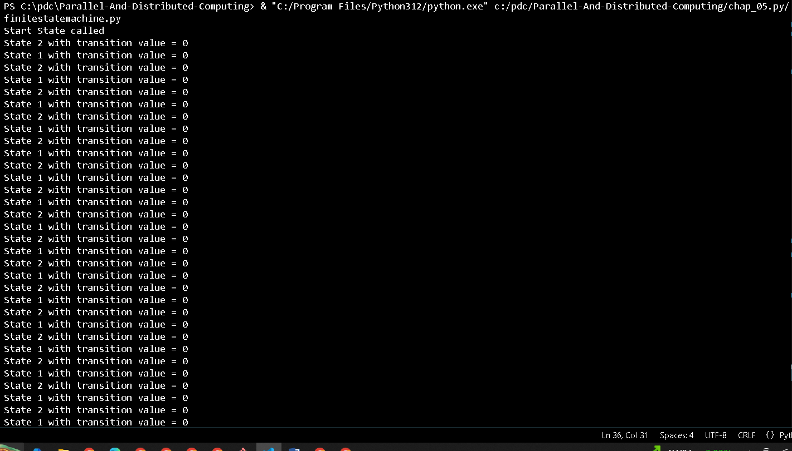
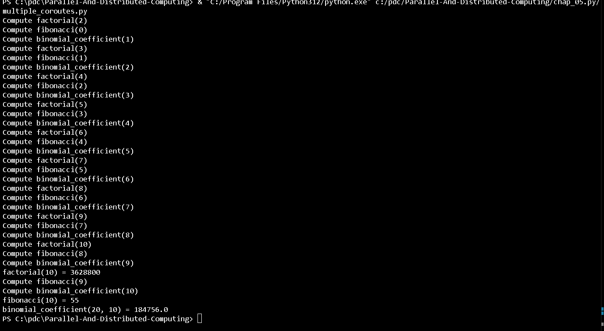

# **Chapter 5: Asynchronous Programming**

Asynchronous programming enables the efficient execution of tasks by allowing processes to suspend and resume execution as needed. Unlike multithreaded programming, asynchronous programming uses a single control flow (single-threaded), making it more predictable and easier to debug. This approach is ideal for event-driven applications and I/O-bound tasks.

## **Contents**
- Using the `concurrent.futures` Python module
- Managing the event loop with `asyncio`
- Handling coroutines with `asyncio`
- Manipulating tasks with `asyncio`
- Dealing with `asyncio` and `future`

# **Concurrent Execution with Thread and Process Pools**

This script demonstrates parallel execution using both thread and process pools with the `concurrent.futures` module. It compares the performance of sequential, thread pool, and process pool execution for computational tasks.

## Output

## **Explanation**

### **Sequential Execution:**
- The script first runs the tasks sequentially, calculating results for each item in the list from `1` to `10`.
- Each item in the list is processed one after the other.

### **Thread Pool Execution:**
- The script then uses a thread pool to run the same tasks concurrently with 5 threads.
- This method allows tasks to run in parallel, though it still uses the same CPU core.

### **Process Pool Execution:**
- Finally, the script uses a process pool to execute tasks concurrently with 5 processes.
- Each task runs in its own process, utilizing multiple CPU cores, resulting in faster execution for CPU-bound tasks.

# **Asyncio Event Loop Simulation**

This script demonstrates the use of the `asyncio` event loop to create and manage asynchronous tasks. Three tasks (`task_A`, `task_B`, and `task_C`) are created and scheduled to run in a sequence, where each task triggers the next one after a random sleep interval.

## Output

## **Explanation**

**Tasks in Sequence**:
- **task_A** is called first, then after some random delay (using `asyncio.sleep`), it calls **task_B**.
- **task_B** follows a similar pattern, calling **task_C** after a delay.
- Finally, **task_C** calls **task_A** to repeat the cycle, ensuring the tasks keep triggering each other until the specified time limit is reached.

# **Asyncio Finite State Machine**

This script demonstrates the implementation of a finite state machine (FSM) using Python's `asyncio` library. The FSM runs in a series of states (`state_1`, `state_2`, `state_3`), transitioning between each based on random input values. The system simulates asynchronous state transitions, where each state waits for a simulated delay before transitioning.

## **Output

## **Explanation**

### **Finite State Machine Overview**
The FSM consists of three states:
- **start_state**: The starting point where the initial state (`state_1` or `state_2`) is determined randomly.
- **state_1**: The first state of the FSM. After executing, it either transitions to `state_2` or `state_3`, based on the transition value.
- **state_2**: The second state of the FSM. Similar to `state_1`, it either transitions to `state_1` or `state_3`.
- **state_3**: The final state, which concludes the FSM process with the message `End State reached`.

### **State Transitions**
- The FSM starts at `start_state`, where a random value determines the next state (`state_1` or `state_2`).
- Each state transitions based on the transition value, either to the next state or to the final state (`state_3`).
- The transition loop continues until the FSM reaches `state_3`.

### **Asynchronous Execution**
- The state transitions occur asynchronously, meaning the program doesn't block waiting for each transition. The `await asyncio.sleep(1)` is used to simulate delays between transitions without blocking the event loop.
- `asyncio.run()` is used to start the asynchronous FSM process.

### **How the Code Works**
1. **`start_state()`**: The entry point that starts the FSM. It randomly selects the next state and triggers the corresponding state function (`state_1` or `state_2`).
2. **`state_1()` and `state_2()`**: The intermediate states that either transition back to another state or move forward to `state_3`.
3. **`state_3()`**: The end state that concludes the FSM cycle.

# **Asyncio Concurrent Computations**

This Python script demonstrates the concurrent execution of multiple mathematical computations using `asyncio`. It calculates the factorial, Fibonacci sequence, and binomial coefficient concurrently, while utilizing `async/await` for asynchronous programming.

## **Output

## **Features:**
- **Factorial Calculation:** Computes the factorial of a given number.
- **Fibonacci Sequence Calculation:** Computes the Fibonacci sequence up to the nth term.
- **Binomial Coefficient Calculation:** Computes the binomial coefficient (n choose k).

